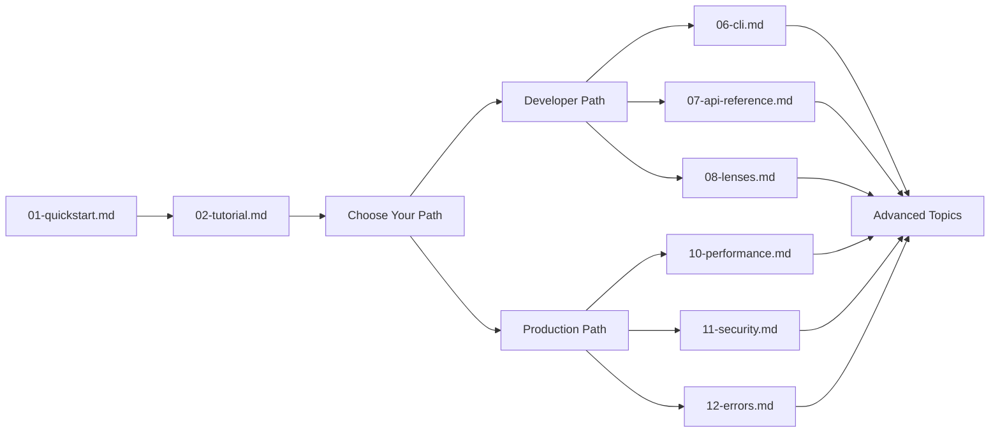

# 📚 FACET v2.0 Documentation

## 🎯 Welcome to FACET Documentation

**The First Deterministic Neural Architecture Description Language (NADL)**

*Transforming AI engineering from artisanal practice to systematic discipline*

---

### 🚀 **What is FACET?**

**FACET (Feature-Aware Contracted Extension for Text)** is a revolutionary approach to AI agent development that brings **software engineering discipline** to neural architectures.

Instead of fragile prompt engineering, FACET provides:
- **🔒 Type Safety** - Compile-time validation of agent behavior
- **⚡ Deterministic Execution** - Predictable, reproducible results
- **🔧 Modular Architecture** - Reusable components and clean abstractions
- **🧪 Testing Framework** - Automated validation of AI behavior

---

## 💡 Why Choose FACET?

### 🎯 **The AI Engineering Crisis**

Traditional AI development suffers from:
- ❌ **Unpredictable behavior** - Same prompts yield different results
- ❌ **Fragile architectures** - Small changes break entire systems
- ❌ **No testing** - Impossible to validate AI behavior
- ❌ **Vendor lock-in** - Tied to specific LLM providers

### ✅ **FACET Solutions**

| Problem | Traditional AI | FACET NADL |
|:---|:---:|:---:|
| **Behavior** | Emergent & unpredictable | **Deterministic & typed** |
| **Testing** | Manual validation | **Automated test suites** |
| **Maintenance** | Brittle & error-prone | **Type-safe & refactorable** |
| **Scaling** | Trial & error | **Mathematical guarantees** |

**FACET transforms AI from black-box magic into white-box engineering.** 🔮➜🔧

## 🚀 Quick Start

**New to FACET?** Follow this recommended learning path:

### 📖 **Learning Journey**

## 📚 Complete Documentation Guide

### 🎯 **Structured Learning Path**

**Follow this comprehensive curriculum designed for progressive skill development:**

| # | Document | Purpose | Difficulty | Time |
|---|----------|---------|------------|------|
| **[01](01-quickstart.md)** | **Quick Start Guide** | Get running in 5 minutes | Beginner | 5 min |
| **[02](02-tutorial.md)** | **Complete Tutorial** | Learn from basics to advanced | Beginner → Advanced | 30-60 min |
| **[03](03-architecture.md)** | **System Architecture** | Understand FACET internals | Intermediate | 20-30 min |
| **[04](04-type-system.md)** | **Type System (FTS)** | Master Facet Type System | Intermediate | 25-35 min |
| **[05](05-examples-guide.md)** | **Examples Guide** | Practical examples explained | Beginner → Advanced | 45-60 min |
| **[06](06-cli.md)** | **CLI Reference** | Command-line interface | Beginner | 15-20 min |
| **[07](07-api-reference.md)** | **Rust API Reference** | Complete Rust API docs | Advanced | 30-40 min |
| **[08](08-lenses.md)** | **Lens Library** | Transformation functions | Intermediate | 20-25 min |
| **[09](09-testing.md)** | **Testing Guide** | @test blocks and mocking | Intermediate | 15-20 min |
| **[10](10-performance.md)** | **Performance Guide** | Optimization and benchmarking | Intermediate | 25-30 min |
| **[11](11-security.md)** | **Security Model** | Security best practices | Intermediate | 20-25 min |
| **[12](12-errors.md)** | **Error Codes** | Troubleshooting guide | Intermediate | 15-20 min |
| **[13](13-import-system.md)** | **Import System** | Modularity and imports | Intermediate | 20-25 min |

### 🎯 Quick Access by Topic

#### 🚀 **Getting Started**
- **[01-quickstart.md](01-quickstart.md)** - Fast setup and first FACET file
- **[05-examples-guide.md](05-examples-guide.md)** - Learn by examples
- **[faq.md](faq.md)** - Frequently asked questions

#### 🔧 **Technical Reference**
- **[03-architecture.md](03-architecture.md)** - System design and components
- **[04-type-system.md](04-type-system.md)** - Complete FTS reference
- **[07-api-reference.md](07-api-reference.md)** - Rust API documentation
- **[08-lenses.md](08-lenses.md)** - Lens function library

#### 🛠️ **Usage & Tools**
- **[06-cli.md](06-cli.md)** - Command-line interface
- **[09-testing.md](09-testing.md)** - Testing framework
- **[13-import-system.md](13-import-system.md)** - Import and modularity

#### ⚡ **Production**
- **[10-performance.md](10-performance.md)** - Performance optimization
- **[11-security.md](11-security.md)** - Security best practices
- **[12-errors.md](12-errors.md)** - Error handling and troubleshooting

## 📖 Key Documents

### For New Users
1. **[01-quickstart.md](01-quickstart.md)** - Get running immediately
2. **[02-tutorial.md](02-tutorial.md)** - Complete learning experience
3. **[05-examples-guide.md](05-examples-guide.md)** - Practical examples

### For Developers
1. **[06-cli.md](06-cli.md)** - CLI usage
2. **[07-api-reference.md](07-api-reference.md)** - Rust integration
3. **[faq.md](faq.md)** - Common questions

### For Production
1. **[10-performance.md](10-performance.md)** - Performance tuning
2. **[11-security.md](11-security.md)** - Security deployment
3. **[12-errors.md](12-errors.md)** - Error handling

## 🔗 Related Documentation

- **[../README.md](../README.md)** - Project overview and status
- **[../facet2-specification.md](../facet2-specification.md)** - Complete technical specification
- **[../examples/](../examples/)** - FACET file examples

## 📊 Documentation Quality

- ✅ **Complete Coverage** - All features documented
- ✅ **Cross-Referenced** - Links between related documents
- ✅ **Progressive Difficulty** - From beginner to advanced
- ✅ **Production Ready** - Enterprise-grade documentation
- ✅ **Regular Updates** - Version-controlled and maintained

## 🎯 Navigation Tips

- **Follow the numbers** for systematic learning
- **Use cross-references** to explore related topics
- **Start with examples** if you prefer hands-on learning
- **Check FAQ** for quick answers to common questions

---

**Ready to master FACET? Start with [01-quickstart.md](01-quickstart.md)!** 🚀

*Documentation automatically generated and maintained. Last updated: 2025-12-09*
| **[01](01-quickstart.md)** | **Quick Start Guide** | Get running in 5 minutes | Beginner | 5 min |
| **[02](02-tutorial.md)** | **Complete Tutorial** | Learn from basics to advanced | Beginner → Advanced | 30-60 min |
| **[03](03-architecture.md)** | **System Architecture** | Understand FACET internals | Intermediate | 20-30 min |
| **[04](04-type-system.md)** | **Type System (FTS)** | Master Facet Type System | Intermediate | 25-35 min |
| **[05](05-examples-guide.md)** | **Examples Guide** | Practical examples explained | Beginner → Advanced | 45-60 min |
| **[06](06-cli.md)** | **CLI Reference** | Command-line interface | Beginner | 15-20 min |
| **[07](07-api-reference.md)** | **Rust API Reference** | Complete Rust API docs | Advanced | 30-40 min |
| **[08](08-lenses.md)** | **Lens Library** | Transformation functions | Intermediate | 20-25 min |
| **[09](09-testing.md)** | **Testing Guide** | @test blocks and mocking | Intermediate | 15-20 min |
| **[10](10-performance.md)** | **Performance Guide** | Optimization and benchmarking | Intermediate | 25-30 min |
| **[11](11-security.md)** | **Security Model** | Security best practices | Intermediate | 20-25 min |
| **[12](12-errors.md)** | **Error Codes** | Troubleshooting guide | Intermediate | 15-20 min |
| **[13](13-import-system.md)** | **Import System** | Modularity and imports | Intermediate | 20-25 min |

### 🎯 Quick Access by Topic

#### 🚀 **Getting Started**
- **[01-quickstart.md](01-quickstart.md)** - Fast setup and first FACET file
- **[05-examples-guide.md](05-examples-guide.md)** - Learn by examples
- **[faq.md](faq.md)** - Frequently asked questions

#### 🔧 **Technical Reference**
- **[03-architecture.md](03-architecture.md)** - System design and components
- **[04-type-system.md](04-type-system.md)** - Complete FTS reference
- **[07-api-reference.md](07-api-reference.md)** - Rust API documentation
- **[08-lenses.md](08-lenses.md)** - Lens function library

#### 🛠️ **Usage & Tools**
- **[06-cli.md](06-cli.md)** - Command-line interface
- **[09-testing.md](09-testing.md)** - Testing framework
- **[13-import-system.md](13-import-system.md)** - Import and modularity

#### ⚡ **Production**
- **[10-performance.md](10-performance.md)** - Performance optimization
- **[11-security.md](11-security.md)** - Security best practices
- **[12-errors.md](12-errors.md)** - Error handling and troubleshooting

## 📖 Key Documents

### For New Users
1. **[01-quickstart.md](01-quickstart.md)** - Get running immediately
2. **[02-tutorial.md](02-tutorial.md)** - Complete learning experience
3. **[05-examples-guide.md](05-examples-guide.md)** - Practical examples

### For Developers
1. **[06-cli.md](06-cli.md)** - CLI usage
2. **[07-api-reference.md](07-api-reference.md)** - Rust integration
3. **[faq.md](faq.md)** - Common questions

### For Production
1. **[10-performance.md](10-performance.md)** - Performance tuning
2. **[11-security.md](11-security.md)** - Security deployment
3. **[12-errors.md](12-errors.md)** - Error handling

## 🔗 Related Documentation

- **[../README.md](../README.md)** - Project overview and status
- **[../facet2-specification.md](../facet2-specification.md)** - Complete technical specification
- **[../examples/](../examples/)** - FACET file examples

## 📊 Documentation Quality

- ✅ **Complete Coverage** - All features documented
- ✅ **Cross-Referenced** - Links between related documents
- ✅ **Progressive Difficulty** - From beginner to advanced
- ✅ **Production Ready** - Enterprise-grade documentation
- ✅ **Regular Updates** - Version-controlled and maintained

## 🎯 Navigation Tips

- **Follow the numbers** for systematic learning
- **Use cross-references** to explore related topics
- **Start with examples** if you prefer hands-on learning
- **Check FAQ** for quick answers to common questions

---

**Ready to master FACET? Start with [01-quickstart.md](01-quickstart.md)!** 🚀

*Documentation automatically generated and maintained. Last updated: 2025-12-09*

